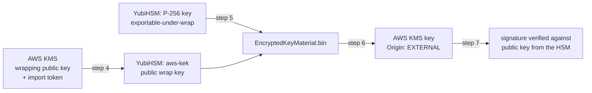

# yubihsm2-aws-kms-byok

Importing a P-256 signing key generated on a **YubiHSM 2 FIPS** into **AWS KMS**, using the
`RSA_AES_KEY_WRAP_SHA_256` wrapping algorithm.

The key is generated inside the HSM, wrapped inside the HSM, and imported into a KMS key whose
material origin is `EXTERNAL`. The final step proves the imported material is the same key by
signing with KMS and verifying with the public key exported from the HSM.



---

## Tested with

| Component | Version |
|---|---|
| Device | YubiHSM 2 FIPS 140-3 |
| Firmware | 2.4.1 |

Commands assume a Linux host. `yubihsm-connector` must be running, plus `yubihsm-shell`,
OpenSSL 3.x, AWS CLI and `jq`.

> Command names differ between YubiHSM SDK releases (for example `put pub_wrapkey` versus
> `put wrapkey-public`). If a command below is rejected, check `help` in `yubihsm-shell` for the
> spelling used by your build.

## Two irreversible decisions

Both must be made before anything else exists on the device:

- **FIPS mode can only be enabled on an empty device.** Enabling it later means a factory reset.
- **`exportable-under-wrap` can only be granted when the key is generated.** It cannot be added
  afterwards, and without it the key can never leave the HSM.

## Conventions

A KMS key is a regional resource, and an import token is only valid in the region that issued it.
Every `aws` command below therefore passes `--region` explicitly.

Object IDs on the HSM (`0x2846`, `0xadf8` below) are assigned by the device. Substitute the values
your device reports.

---

## Step 0 — Enable FIPS mode

**Docs:** [Set FIPS Mode](https://docs.yubico.com/hardware/yubihsm-2/hsm-2-user-guide/hsm2-option-fips-guide.html) ·
[Reset to Factory Settings](https://docs.yubico.com/hardware/yubihsm-2/hsm-2-user-guide/hsm2-reset-to-factory.html)

The device must be in factory state. If `fips-mode` does not report `03` (pending), factory-reset
first.

```console
$ yubihsm-shell -a get-option --opt-name fips-mode
Option value is: 03

$ yubihsm-shell -a put-option --opt-name fips-mode --opt-value 01
```

Setting the option is only half of it. The approved mode of operation also requires **deleting the
default authentication key** — changing its password is not enough. Create a replacement first,
otherwise you lock yourself out:

```console
$ yubihsm-shell
yubihsm> connect
yubihsm> session open 1 password
Created session 0

yubihsm> put authkey 0 2 admin 1 generate-asymmetric-key,put-public-wrap-key,export-wrapped,delete-asymmetric-key,delete-wrap-key,delete-authentication-key sign-ecdsa,exportable-under-wrap,export-wrapped
Enter password: ********
Stored Authentication key 0x0002
```

The second capability list is the **delegated** capabilities: the ceiling on what this key may grant
to objects it creates. It must cover `sign-ecdsa` and `exportable-under-wrap` for the signing key in
Step 1, and `export-wrapped` for the wrap key in Step 4.

Re-open the session with the new key, then remove the default one and verify:

```console
yubihsm> session close 0
yubihsm> session open 2 <password>
Created session 0

yubihsm> delete 0 1 authentication-key
yubihsm> get option 0 fips-mode
Option value is: 01
```

FIPS mode disables `rsa-pkcs1-decrypt`, `rsa-pkcs1-sha1`, `rsa-pss-sha1`, `ecdsa-sha1` and `eck256`.
P-256 with ECDSA-SHA256 — everything this runbook needs — remains available.

---

## Step 1 — Generate the signing key

**Docs:** [GENERATE ASYMMETRIC KEY](https://docs.yubico.com/hardware/yubihsm-2/hsm-2-user-guide/hsm2-cmd-reference.html#generate-asymmetric-key-command) ·
[Algorithms](https://docs.yubico.com/hardware/yubihsm-2/hsm-2-user-guide/hsm2-intro-core-concepts.html#algorithms)

```console
yubihsm> generate asymmetric 0 0 bootloader-key-1 1 sign-ecdsa,exportable-under-wrap ecp256
Generated Asymmetric key 0x2846
```

`exportable-under-wrap` is mandatory here and cannot be added later.

---

## Step 2 — Create the KMS key with no key material

**Docs:** [Create a KMS key with no key material](https://docs.aws.amazon.com/kms/latest/developerguide/importing-keys-create-cmk.html)

```console
$ aws kms create-key \
    --region <region> \
    --key-spec ECC_NIST_P256 \
    --key-usage SIGN_VERIFY \
    --origin EXTERNAL \
    --query 'KeyMetadata.KeyId' --output text
```

Note the returned key ID — every command below needs it.

---

## Step 3 — Download the wrapping public key and import token

**Docs:** [Download the wrapping public key and import token](https://docs.aws.amazon.com/kms/latest/developerguide/importing-keys-get-public-key-and-token.html) ·
[Select a wrapping algorithm](https://docs.aws.amazon.com/kms/latest/developerguide/importing-keys-get-public-key-and-token.html#select-wrapping-algorithm) ·
[GetParametersForImport](https://docs.aws.amazon.com/kms/latest/APIReference/API_GetParametersForImport.html)

```console
$ aws kms get-parameters-for-import \
    --region <region> \
    --key-id <key-id> \
    --wrapping-algorithm RSA_AES_KEY_WRAP_SHA_256 \
    --wrapping-key-spec RSA_4096 \
    --output json > params.json
```

Both values come back base64-encoded. Decode and save them:

```console
$ jq -r .PublicKey   params.json | openssl enc -d -base64 -A -out WrappingPublicKey.bin
$ jq -r .ImportToken params.json | openssl enc -d -base64 -A -out ImportToken.bin
```

The pair is valid for **24 hours** and must be used together. If it expires, repeat this step and
re-wrap.

---

## Step 4 — Import the wrapping public key into the HSM

**Docs:** [PUT PUBLIC WRAP KEY](https://docs.yubico.com/hardware/yubihsm-2/hsm-2-user-guide/hsm2-cmd-reference.html#put-public-wrap-key-command) ·
[Capabilities](https://docs.yubico.com/hardware/yubihsm-2/hsm-2-user-guide/hsm2-intro-core-concepts.html#capabilities)

`put pub_wrapkey` expects PEM, AWS hands out DER:

```console
$ openssl rsa -pubin -inform DER -in WrappingPublicKey.bin \
              -outform PEM -out WrappingPublicKey.pem
```

```console
yubihsm> put pub_wrapkey 0 0 aws-kek 1 export-wrapped exportable-under-wrap,sign-ecdsa WrappingPublicKey.pem
Stored Wrap key 0xadf8
```

---

## Step 5 — Wrap the private key inside the HSM

**Docs:** [EXPORT RSA WRAPPED KEY](https://docs.yubico.com/hardware/yubihsm-2/hsm-2-user-guide/hsm2-cmd-reference.html#export-rsa-wrapped-key-command)

```console
yubihsm> get rsa_wrapped_key 0 0xadf8 asymmetric-key 0x2846 aes256 rsa-oaep-sha256 mgf1-sha256 EncryptedKeyMaterial.bin
```

`aes256` + `rsa-oaep-sha256` + `mgf1-sha256` is what AWS calls `RSA_AES_KEY_WRAP_SHA_256`.

Use `get rsa_wrapped_key`, not `get rsa_wrapped`. Only the former emits a bare PKCS#8 private key,
which is what `ImportKeyMaterial` expects; the latter emits a YubiHSM-internal object format.

Three objects are checked independently: the authentication key and the wrap key both need
`export-wrapped`, the target key needs `exportable-under-wrap`, and all three must share a domain.

---

## Step 6 — Upload the wrapped key to AWS KMS

**Docs:** [Import the key material](https://docs.aws.amazon.com/kms/latest/developerguide/importing-keys-import-key-material.html) ·
[ImportKeyMaterial](https://docs.aws.amazon.com/kms/latest/APIReference/API_ImportKeyMaterial.html)

```console
$ aws kms import-key-material \
    --region <region> \
    --key-id <key-id> \
    --encrypted-key-material fileb://EncryptedKeyMaterial.bin \
    --import-token fileb://ImportToken.bin \
    --expiration-model KEY_MATERIAL_DOES_NOT_EXPIRE
```

```console
$ aws kms describe-key \
    --region <region> \
    --key-id <key-id> \
    --query 'KeyMetadata.[KeyState,Origin,KeySpec]'
[
    "Enabled",
    "EXTERNAL",
    "ECC_NIST_P256"
]
```

---

## Step 7 — Sign with AWS KMS, verify with the HSM public key

**Docs:** [Sign](https://docs.aws.amazon.com/kms/latest/APIReference/API_Sign.html) ·
[GET PUBLIC KEY](https://docs.yubico.com/hardware/yubihsm-2/hsm-2-user-guide/hsm2-cmd-reference.html#get-public-key-command)

Export the public key from the HSM:

```console
yubihsm> get pubkey 0 0x2846 asymmetric-key hsm-pubkey.pem
```

Sign a test message with KMS:

```console
$ head -c 64 /dev/urandom > message.bin

$ aws kms sign \
    --region <region> \
    --key-id <key-id> \
    --message fileb://message.bin \
    --message-type RAW \
    --signing-algorithm ECDSA_SHA_256 \
    --query Signature --output text | base64 -d > signature.der
```

Without a region the call resolves against the wrong one, the key is not found, and the empty result
surfaces downstream as a base64 decoding error rather than as a KMS error.

Verify against the HSM public key:

```console
$ openssl dgst -sha256 -verify hsm-pubkey.pem -signature signature.der message.bin
Verified OK
```

`Verified OK` proves the imported material is the same key.

---

## Step 8 — Clean up

`EncryptedKeyMaterial.bin` is your private key under encryption — delete it once the import is
confirmed. The wrapping public key, the import token and `params.json` contain nothing secret.

```console
$ rm EncryptedKeyMaterial.bin
```

```console
yubihsm> delete 0 0xadf8 public-wrap-key
```

If `public-wrap-key` is rejected as a type, check `help delete` on your SDK build.

---

## What imported key material changes in KMS

| | |
|---|---|
| **Rotation** | Automatic key rotation is not available. Rotating means generating and importing new material yourself. |
| **Re-import** | If the material is deleted or expires, the key becomes unusable until *the same bytes* are imported again. Either keep the wrapped blob, or be able to re-export from the HSM. |
| **Expiration** | `KEY_MATERIAL_DOES_NOT_EXPIRE` is a deliberate choice. The alternative sets a deletion date, after which the key stops working until re-imported. |
| **Import window** | The wrapping public key and import token are valid for 24 hours and only work as a pair. |

---

## References

- [YubiHSM Command Reference](https://docs.yubico.com/hardware/yubihsm-2/hsm-2-user-guide/hsm2-cmd-reference.html)
- [YubiHSM 2 BYOK for Azure](https://docs.yubico.com/hardware/yubihsm-2/hsm-2-user-guide/hsm2-byok-azure.html) — the only official Yubico BYOK guide; useful because it exercises the same `CKM_RSA_AES_KEY_WRAP` primitive
- [AWS KMS: importing key material](https://docs.aws.amazon.com/kms/latest/developerguide/importing-keys.html)
- [PKCS #11 v2.40, §2.1.21 `CKM_RSA_AES_KEY_WRAP`](http://docs.oasis-open.org/pkcs11/pkcs11-curr/v2.40/os/pkcs11-curr-v2.40-os.html) — normative definition of the wrapping construction AWS calls `RSA_AES_KEY_WRAP_*`

## License

MIT — see [LICENSE](LICENSE).

Not affiliated with Yubico or Amazon Web Services. Verified only on the versions listed above.
